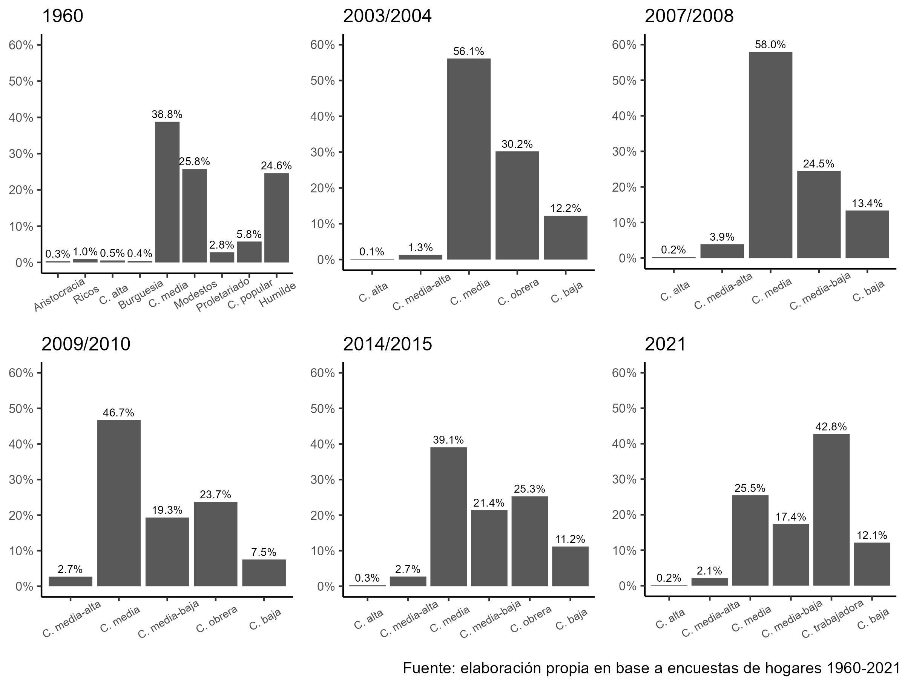

class: inverse right middle 

```{r xaringanExtra, echo = FALSE}
xaringanExtra::use_progress_bar(color = "orange", location = "top", height = "10px")

xaringanExtra::use_tile_view()
xaringanExtra::use_scribble()
```

```{r carga de bases y librerias, include = FALSE, message=FALSE, warning=FALSE, error=FALSE}

pacman::p_load(tidyverse, haven, gridExtra, grid, occupar, ggpubr, ggsci, gtsummary,
               survey, jtools, huxtable, nnet, broom, kableExtra)

knitr::opts_chunk$set(echo = FALSE, warning = FALSE, message = FALSE, error = FALSE, dpi = 300,
                      dev.args=list(bg="transparent"), fig.pos = "H", out.extra = "")

theme_set(theme_classic())

theme_update(panel.background = element_rect(fill = "transparent", colour = NA),
             plot.background = element_rect(fill = "transparent", colour = NA),
             legend.key = element_rect(fill = "transparent", colour = NA),
             legend.background= element_rect(fill = "transparent", colour = NA))


rm(list = ls())

#bases argentinas
load("bases/germani_sampleb.RData")
base1960 <- sample_B
base2003 <- read_spss("bases/base_2003_2004.sav")
base2007 <- read_spss("bases/base_2007.sav")
base2010 <- read_spss("bases/base_2010.sav")
base2015 <- read_spss("bases/base_2015.sav")
load("bases/base_2021.RData")
base2021 <- base_pirc
rm(base_pirc)

#World Values Survey
wvs <- readRDS("bases/WVS_Trend_v2_0.rds")

#Latinobarómetro
latino <- readRDS("bases/latinobarometro.RDS")
```


```{r variables, include = FALSE, message=FALSE, warning=FALSE, error=FALSE}
#1960

base1960$q36[base1960$q36 == 0] <- NA
base1960$q3 <- as.numeric(base1960$q3)

base1960 <- base1960 %>%
  mutate(q36_f = factor(q36, labels = c("Ricos", "Modestos", "Humilde", "C. alta",
                                        "C. media", "C. popular", "Aristocracia",
                                        "Burguesia", "Proletariado")),
         q36_f = factor(q36_f, levels = c("Aristocracia", "Ricos", "C. alta", "Burguesia",
                                   "C. media", "Modestos", "Proletariado",
                                   "C. popular", "Humilde")),
         clasesub_1960 = car::recode(q36, "c(1,4,7,8)=1; 5=2; 2=3; c(3,6,9)=4"),
         clasesub_1960_f = factor(clasesub_1960, labels = c("C. alta", "C. media",
                                                            "C. media-baja",
                                                            "C. baja")),
         clase_recod = car::recode(clasesub_1960, "1:2=1;3=2;4=3"),
         clase_recod_f = factor(clase_recod, labels = c("C. media / alta",
                                                            "C. media-baja",
                                                            "C. baja")),
         clasesub_dic = car::recode(clase_recod, "1:2=1; 3=2"),
         clasesub_dic_f = factor(clasesub_dic, labels = c("C.s medias", "C. obrera / baja")),
         egp5 = case_when(q3 > 0 & q3 <= 2 ~ 1,
                                 q3 == 3 | q3 == 4 ~ 3,
                                 q3 == 5 & (v8 >= 4 & v8 <9) ~ 3,
                                 q3 == 5 & v8 < 4 ~ 5,
                                 q3 >= 6 & q3 <= 10 ~ 1,
                                 q3 == 11 ~ 2,
                                 q3 == 12 | q3 == 13 ~ 4,
                                 q3 == 14 ~ 5),
         egp5_f = factor(egp5, labels = c("I+II", "III", "IV", "V+VI", "VII")))


#2003/2004
base2003 <- base2003 %>%
  mutate(clasesub_2003 = case_when(p64a_u == 1 ~ 5,
                                   p64a_u == 2 ~ 4,
                                   p64a_u == 3 ~ 3,
                                   p64a_u == 4 ~ 2,
                                   p64a_u == 5 ~ 1,
                                   (p64a_u > 5 | is.na(p64a_u)) & p64b_u == 1 ~ 5,
                                   (p64a_u > 5 | is.na(p64a_u)) & p64b_u == 2 ~ 4,
                                   (p64a_u > 5 | is.na(p64a_u)) & p64b_u == 3 ~ 3,
                                   (p64a_u > 5 | is.na(p64a_u)) & p64b_u == 4 ~ 2,
                                   (p64a_u > 5 | is.na(p64a_u)) & p64b_u == 5 ~ 1,
                                   TRUE ~ NA_real_),
         clasesub_2003_f = factor(clasesub_2003, labels = c("C. alta",
                                                             "C. media-alta",
                                                             "C. media",
                                                             "C. obrera",
                                                             "C. baja")),
         clasesub_recod = car::recode(clasesub_2003, "1:2=1; 3=2; 4=3; 5=4"),
         clasesub_recod_f = factor(clasesub_recod, labels = c("C. media-alta",
                                                            "C. media",
                                                            "C. obrera",
                                                            "C. baja")),
         clasesub_dic = car::recode(clasesub_recod, "1:2=1; 3:4=2"),
         clasesub_dic_f = factor(clasesub_dic, labels = c("C.s medias", "C. obrera / baja")),
         ocupacion = p57bciuo_u,
         sv = case_when(p57d1_u == 4 | p57d2_u >= 2 ~ 1,
                        TRUE ~ 0),
         categoria = case_when(p57d_u == 6 ~ 1,
                               p57d_u == 5 & sv == 1 ~ 1,
                               p57d_u == 5 & sv != 1 ~ 2,
                               p57d_u %in% c(1:4, 7,8) ~ 3,
                               TRUE ~ NA_real_),
         tamano = case_when((p57d5est_u + p57d5tem_u) <= 5 ~ 1,
                            (p57d5est_u + p57d5tem_u) > 5 | is.na(p57d5est_u + p57d5tem_u) ~ 2,
                            TRUE ~ NA_real_))


#2007
base2007 <- base2007 %>%
  mutate(clasesub_2007 = case_when(p161 == 1 ~ 6,
                                   p161 == 3 ~ 5,
                                   p161 == 4 ~ 4,
                                   p161 == 5 ~ 3,
                                   p161 == 6 ~ 1,
                                   (p161 > 6 | is.na(p161)) & p161a == 1 ~ 6,
                                   (p161 > 6 | is.na(p161)) & p161a == 3 ~ 5,
                                   (p161 > 6 | is.na(p161)) & p161a == 4 ~ 4,
                                   (p161 > 6 | is.na(p161)) & p161a == 5 ~ 3,
                                   (p161 > 6 | is.na(p161)) & p161a == 6 ~ 1,
                                   TRUE ~ NA_real_),
         clasesub_2007_f = factor(clasesub_2007, labels = c("C. alta",
                                                             "C. media-alta",
                                                             "C. media",
                                                             "C. media-baja",
                                                             "C. baja")),
         clasesub_recod = car::recode(clasesub_2007, "1:3=1; 4=2; 5=3; 6=4"),
         clasesub_recod_f = factor(clasesub_recod, labels = c("C. media-alta",
                                                              "C. media",
                                                              "C. media-baja",
                                                              "C. baja")),
         clasesub_dic = car::recode(clasesub_recod, "1:3=1; 4=2"),
         clasesub_dic_f = factor(clasesub_dic, labels = c("C.s medias", "C. obrera / baja")),
         ocupacion = as.integer(p046a),
         sv = case_when(p051 == 1 ~ 1,
                        TRUE ~ 0),
         categoria = case_when(p047 == 10 ~ 1,
                               p047 == 9 & sv == 1 ~ 1,
                               p047 == 9 & (sv != 1 | is.na(sv)) ~ 2,
                               p047 %in% c(1:8) ~ 3,
                               TRUE ~ NA_real_),
         tamano = case_when(p056a <= 2 ~ 1,
                            p056a > 3 & p056a <= 7 ~ 2,
                            TRUE ~ NA_real_))


#2009/2010
base2010 <- base2010 %>%
  mutate(clasesub_2010 = case_when(S.83a == 1 ~ 5,
                                   S.83a == 2 ~ 4,
                                   S.83a == 3 ~ 3,
                                   S.83a == 4 ~ 2,
                                   S.83a == 5 ~ 1,
                                   (S.83a > 5 | is.na(S.83a)) & S.83b == 1 ~ 5,
                                   (S.83a > 5 | is.na(S.83a)) & S.83b == 2 ~ 4,
                                   (S.83a > 5 | is.na(S.83a)) & S.83b == 3 ~ 3,
                                   (S.83a > 5 | is.na(S.83a)) & S.83b == 4 ~ 2,
                                   (S.83a > 5 | is.na(S.83a)) & S.83b == 5 ~ 1,
                                   TRUE ~ NA_real_),
         clasesub_2010_f = factor(clasesub_2010, labels = c("C. media-alta",
                                                            "C. media",
                                                            "C. media-baja",
                                                            "C. obrera",
                                                            "C. baja")),
         clasesub_dic = car::recode(clasesub_2010, "1:3=1; 4:5=2"),
         clasesub_dic_f = factor(clasesub_dic, labels = c("C.s medias", "C. obrera / baja")),
         ocupacion = as.integer(s.59),
         sv = case_when(S.55 == 1 ~ 1,
                        TRUE ~ 0),
         categoria = case_when(S.53 == 3 ~ 1,
                               S.53 == 2 & sv == 1 ~ 1,
                               S.53 == 2 & (sv != 1 | is.na(sv)) ~ 2,
                               S.53 %in% c(1, 4, 5) ~ 3,
                               TRUE ~ NA_real_),
         tamano = case_when(S.54a <= 5 ~ 1,
                            S.54a > 5 & S.54a < 9995 ~ 2,
                            TRUE ~ NA_real_))


#2014-2015

base2015 <- base2015 %>%
  mutate(clasesub_2015 = case_when(v260a == 1 ~ 6,
                                   v260a == 2 ~ 5,
                                   v260a == 3 ~ 4,
                                   v260a == 4 ~ 3,
                                   v260a == 5 ~ 2,
                                   v260a == 6 ~ 1,
                                   is.na(v260a) & v261a == 1 ~ 6,
                                   is.na(v260a) & v261a == 2 ~ 5,
                                   is.na(v260a) & v261a == 3 ~ 4,
                                   is.na(v260a) & v261a == 4 ~ 3,
                                   is.na(v260a) & v261a == 5 ~ 2,
                                   is.na(v260a) & v261a == 6 ~ 1,
                                   TRUE ~ NA_real_),
         clasesub_2015_f = factor(clasesub_2015, labels = c("C. alta",
                                                            "C. media-alta",
                                                            "C. media",
                                                            "C. media-baja",
                                                            "C. obrera",
                                                            "C. baja")),
         clasesub_recod = car::recode(clasesub_2015, "1:2=1; 3=2; 4=3; 5=4; 6=5"),
         clasesub_recod_f = factor(clasesub_recod, labels = c("C. media-alta",
                                                              "C. media",
                                                              "C. media-baja",
                                                              "C. obrera",
                                                              "C. baja")),
         clasesub_dic = car::recode(clasesub_recod, "1:3=1; 4:5=2"),
         clasesub_dic_f = factor(clasesub_dic, labels = c("C.s medias", "C. obrera / baja")),
         ciuo = v183ciuo,
         sv = car::recode(v186, "2=0; 9=NA"),
         categoria = case_when(cat_ocup == 1 ~ 1,
                               cat_ocup == 2 & sv == 1 ~ 1,
                               cat_ocup == 2 & (sv == 0 | is.na(sv)) ~ 2,
                               cat_ocup == 3 | cat_ocup == 4 ~ 3,
                               TRUE ~ NA_real_),
         tamano = car::recode(v189, "1:2=1; 3:hi=2"),
         rural = case_when(v182caes %in% c("0100", "0101", "0102", "0103", "0104", "0200",
                                           "0300") ~ 1,
                           TRUE ~ 0))

base2015$ciuo <- str_remove(base2015$ciuo, "^0+")
base2015$ciuo <- as.integer(base2015$ciuo)

#2021
base2021 <- base2021 %>%
  mutate(M11.6 = car::recode(M11.6, "99 = NA"),
         clasesub_2021_f = factor(M11.6, labels = c("C. alta",
                                                     "C. media-alta",
                                                     "C. media",
                                                     "C. media-baja",
                                                     "C. trabajadora",
                                                     "C. baja")),
         clasesub_recod = car::recode(M11.6, "1:2=1; 3=2; 4=3; 5=4; 6=5"),
         clasesub_recod_f = factor(clasesub_recod, labels = c("C. media-alta",
                                                              "C. media",
                                                              "C. media-baja",
                                                              "C. trabajadora",
                                                              "C. baja")),
         clasesub_dic = car::recode(clasesub_recod, "1:3=1; 4:5=2"),
         clasesub_dic_f = factor(clasesub_dic, labels = c("C.s medias", "C. obrera / baja")),
         ciuo = CIUO_encuestado,
         sv = car::recode(M3.9, "1:2=1; 3=0; 99=NA"),
         categoria = case_when(M3.5 == 1 ~ 1,
                               M3.5 == 2 & sv == 1 ~ 1,
                               M3.5 == 2 & (sv != 1 | is.na(sv)) ~ 2,
                               M3.5 >= 3 & M3.5 < 99 ~ 3,
                               TRUE ~ NA_real_),
         tamano = case_when(M3.6 <= 2 ~ 1,
                            M3.6 > 2 & M3.6 < 99 ~ 2,
                            TRUE ~ NA_real_),
         rural = case_when(CAES_letra == "A" ~ 1,
                           TRUE ~ 0),
         sexo_f = factor(SEXO, labels = c("Varón", "Mujer")),
         edad_grupo = factor(car::recode(M2.4, "18:29=1; 30:39=2; 40:65=3;
                                    66:hi=4; else=NA"),
                             labels = c("18-29", "30-39", "40-65", "66-")),
         nivel_ed = case_when(M2.9 == 0 | M2.9 == 1 | M2.9 == 2 | M2.9 == 3 | 
                              M2.9 == 9 | M2.9 == 10 ~ "Primario",
                              M2.9 == 4 | M2.9 == 5 ~ "Secundario",
                              M2.9 >= 6 & M2.9 <= 8 ~ "Superior",
                              TRUE ~ NA_character_),
         formal = case_when(M3.10 == 1 | M3.10 == 2 | M3.15 == 3 ~ "Formal",
                              TRUE ~ "Informal"),
         rama = case_when(CAES_letra %in% c("A", "B") ~ "Act. primarias",
                          CAES_letra %in% c("C", "D", "E") ~ "Industria",
                          CAES_letra == "F" ~ "Construcción",
                          CAES_letra == "G" ~ "Comercio",
                          CAES_letra %in% c("H", "I", "J", "K", "L",
                                            "M", "N", "P", "Q", "R", "S",
                                            "T") ~ "Servicios",
                          CAES_letra %in% c("O", "U") ~ "Adm. pública"),
         afiliacion = case_when(M3.13.A == 1 ~ "Sindicalizado",
                                TRUE ~ "No sindicalizado"),
         sv_o = car::recode(M12.22, "1:2=1; 3=0; 99=NA"),
         categoria_o = case_when(M12.20 == 1 ~ 1,
                               M12.20 == 2 & sv_o < 3 ~ 1,
                               M12.20 == 2 & (sv_o >= 3 | is.na(sv_o)) ~ 2,
                               M12.20 >= 3 & M12.20 < 99 ~ 3,
                               TRUE ~ NA_real_),
         tamano_o = case_when(M12.21 <= 2 ~ 1,
                            M12.21 > 2 & M12.21 < 99 ~ 2,
                            TRUE ~ NA_real_),
         rural_o = case_when(M12.19 == 1 ~ 1,
                           TRUE ~ 0),
         ipcf = itf_imp / MIEMBROS,
         log_ipcf = log(ipcf),
         politica = car::recode(M16.1, "1=1; 4=2; 2:3=3; 5=4; 6=5; 7:8=6; else=NA"),
         politica = factor(politica, labels = c("Kirchnerismo", "Peronismo no K", "UCR/PRO", "Izquierda",
                                                "Libertarios", "Ninguno")))

wvs <- wvs %>% 
  mutate(clase_sub = car::recode(X045, "1:2 = 1; 3=2; 4=3; 5=4; else=NA"),
         clase_sub_f = factor(clase_sub, labels = c("C. Media-alta",
                                                    "C. Media-baja", "C. Trabajadora",
                                                    "C. Baja"))) %>% 
  filter(S003 == 32)

latino <- latino %>% 
  mutate(clase_sub = car::recode(clase_sub, "1:2=1; 3=2; 4=3; 5=4; else=NA"),
         clase_sub_f = factor(clase_sub, labels = c("C. Media-alta", "C. Media",
                                                    "C. Media-baja", "C. Baja")))
```


```{r egp, include = FALSE, message=FALSE, warning=FALSE, error=FALSE}
#2003
base2003$ciuo <- isco88to08(base2003$ocupacion)

base2003 <- base2003 %>%
  mutate(egp = case_when(
    #Patrones
    categoria == 1 & tamano == 2 ~ 1,
    categoria == 1 & tamano == 1 ~ 5,

    #Cuenta propia
    categoria == 2 & ((ciuo >= 1000 & ciuo < 1400)) ~ 1,
    categoria == 2 & (ciuo >= 1400 & ciuo < 2000) ~ 2,

    categoria == 2 & ciuo %in% c(2165, 2221, 2222, 2513:2519, 2320, 2330, 2341, 2342,
                                 2351:2359, 2421:2424, 2621, 2622, 2651:2659, 2636) ~ 2,
    categoria == 2 & (ciuo >= 2000 & ciuo < 3000) ~ 1,

    categoria == 2 & ciuo %in% c(3221, 3222, 3311:3314, 3411:3413) ~ 3,
    categoria == 2 & (ciuo >= 3000 & ciuo < 4000) ~ 2,

    categoria == 2 & (ciuo %in% c(5211, 5212, 5413, 5414) |
                        (ciuo >= 9000 & ciuo < 9999) | (ciuo >= 6300 & ciuo < 7000)) ~ 10,
    categoria == 2 & ((ciuo >= 4000 & ciuo < 6000) | (ciuo >= 7000 & ciuo < 9000)) ~ 6,
    categoria == 2 & (ciuo >= 6000 & ciuo < 6300) ~ 7,

    #Empleados
    categoria == 3 & (ciuo >= 1000 & ciuo < 1400) ~ 1,
    categoria == 3 & (ciuo >= 1400 & ciuo < 2000) ~ 2,

    categoria == 3 & ciuo %in% c(2165, 2221, 2222, 2513:2519, 2320, 2330, 2341, 2342,
                                 2351:2359, 2421:2424, 2621, 2622, 2651:2659, 2636) ~ 2,
    categoria == 3 & (ciuo >= 2000 & ciuo < 3000) ~ 1,

    categoria == 3 & ciuo %in% c(3221, 3222, 3311:3314, 3411:3413) & (sv != 1 | is.na(sv)) ~ 3,
    categoria == 3 & (ciuo >= 3000 & ciuo < 4000) ~ 2,

    categoria == 3 & ciuo %in% c(4412, 4419) & (sv != 1 | is.na(sv)) ~ 4,
    categoria == 3 & (ciuo >= 4000 & ciuo < 5000) & (sv != 1 | is.na(sv)) ~ 3,

    categoria == 3 & ciuo %in% c(5111:5113) & (sv != 1 | is.na(sv)) ~ 3,
    categoria == 3 & ciuo %in% c(5120, 5141, 5142, 5153, 5163, 5164, 5165, 5169) & (sv != 1 | is.na(sv)) ~ 9,
    categoria == 3 & ciuo %in% c(5211, 5212, 5413, 5414, 5419) ~ 10,
    categoria == 3 & ciuo %in% c(5411, 5412) ~ 10,
    categoria == 3 & (ciuo >= 5000 & ciuo < 6000) & (sv != 1 | is.na(sv)) ~ 4,

    categoria == 3 & (ciuo >= 3000 & ciuo < 6000) & sv == 1 ~ 2, #supervisores NM

    categoria == 3 & (ciuo >= 6000 & ciuo < 7000) ~ 11,

    categoria == 3 & (ciuo >= 7000 & ciuo < 9000) & (sv != 1 | is.na(sv)) ~ 9,
    categoria == 3 & (ciuo >= 9000 & ciuo < 9999) & (sv != 1 | is.na(sv)) ~ 10,
    categoria == 3 & (ciuo >= 7000 & ciuo < 9999) & sv == 1 ~ 8, #supervisores M
    ciuo == 110 ~ 2,
    ciuo == 210 | ciuo == 310 ~ 8,
    TRUE ~ NA_real_
  ))

base2003$egp_f <- factor(base2003$egp, labels = c("I", "II", "IIIa", "IIIb",
                                          "IVa", "IVb", "IVc", "V",
                                          "VI", "VIIa", "VIIb"))

base2003$egp5 <- car::recode(base2003$egp, "1:2=1; 3:4=2; 5:7=3; 8:9=4; 10:11=5")
base2003$egp5_f <- factor(base2003$egp5, labels = c("I+II", "III", "IV", "V+VI", "VII"))


#2007
base2007$ciuo <- isco88to08(base2007$ocupacion)

base2007 <- base2007 %>%
  mutate(ciuo = case_when(ocupacion %in% c(5164, 3452, 5223, 7125, 8342) ~ ocupacion,
                          TRUE ~ ciuo))

base2007 <- base2007 %>%
  mutate(egp = case_when(
    #Patrones
    categoria == 1 & tamano == 2 ~ 1,
    categoria == 1 & tamano == 1 ~ 5,

    #Cuenta propia
    categoria == 2 & ((ciuo >= 1000 & ciuo < 1400)) ~ 1,
    categoria == 2 & (ciuo >= 1400 & ciuo < 2000) ~ 2,

    categoria == 2 & ciuo %in% c(2165, 2221, 2222, 2513:2519, 2320, 2330, 2341, 2342,
                                 2351:2359, 2421:2424, 2621, 2622, 2651:2659, 2636) ~ 2,
    categoria == 2 & (ciuo >= 2000 & ciuo < 3000) ~ 1,

    categoria == 2 & ciuo %in% c(3221, 3222, 3311:3314, 3411:3413) ~ 3,
    categoria == 2 & (ciuo >= 3000 & ciuo < 4000) ~ 2,

    categoria == 2 & (ciuo %in% c(5211, 5212, 5413, 5414) |
                        (ciuo >= 9000 & ciuo < 9999) | (ciuo >= 6300 & ciuo < 7000)) ~ 10,
    categoria == 2 & ((ciuo >= 4000 & ciuo < 6000) | (ciuo >= 7000 & ciuo < 9000)) ~ 6,
    categoria == 2 & (ciuo >= 6000 & ciuo < 6300) ~ 7,

    #Empleados
    categoria == 3 & (ciuo >= 1000 & ciuo < 1400) ~ 1,
    categoria == 3 & (ciuo >= 1400 & ciuo < 2000) ~ 2,

    categoria == 3 & ciuo %in% c(2165, 2221, 2222, 2513:2519, 2320, 2330, 2341, 2342,
                                 2351:2359, 2421:2424, 2621, 2622, 2651:2659, 2636) ~ 2,
    categoria == 3 & (ciuo >= 2000 & ciuo < 3000) ~ 1,

    categoria == 3 & ciuo %in% c(3221, 3222, 3311:3314, 3411:3413) & (sv != 1 | is.na(sv)) ~ 3,
    categoria == 3 & (ciuo >= 3000 & ciuo < 4000) ~ 2,

    categoria == 3 & ciuo %in% c(4412, 4419) & (sv != 1 | is.na(sv)) ~ 4,
    categoria == 3 & (ciuo >= 4000 & ciuo < 5000) & (sv != 1 | is.na(sv)) ~ 3,

    categoria == 3 & ciuo %in% c(5111:5113) & (sv != 1 | is.na(sv)) ~ 3,
    categoria == 3 & ciuo %in% c(5120, 5141, 5142, 5153, 5163, 5164, 5165, 5169) & (sv != 1 | is.na(sv)) ~ 9,
    categoria == 3 & ciuo %in% c(5211, 5212, 5413, 5414, 5419) ~ 10,
    categoria == 3 & ciuo %in% c(5411, 5412) ~ 10,
    categoria == 3 & (ciuo >= 5000 & ciuo < 6000) & (sv != 1 | is.na(sv)) ~ 4,

    categoria == 3 & (ciuo >= 3000 & ciuo < 6000) & sv == 1 ~ 2, #supervisores NM

    categoria == 3 & (ciuo >= 6000 & ciuo < 7000) ~ 11,

    categoria == 3 & (ciuo >= 7000 & ciuo < 9000) & (sv != 1 | is.na(sv)) ~ 9,
    categoria == 3 & (ciuo >= 9000 & ciuo < 9999) & (sv != 1 | is.na(sv)) ~ 10,
    categoria == 3 & (ciuo >= 7000 & ciuo < 9999) & sv == 1 ~ 8, #supervisores M
    ciuo == 110 ~ 2,
    ciuo == 210 | ciuo == 310 ~ 8,
    TRUE ~ NA_real_
  ))

base2007$egp_f <- factor(base2007$egp, labels = c("I", "II", "IIIa", "IIIb",
                                                  "IVa", "IVb", "IVc", "V",
                                                  "VI", "VIIa", "VIIb"))

base2007$egp5 <- car::recode(base2007$egp, "1:2=1; 3:4=2; 5:7=3; 8:9=4; 10:11=5")
base2007$egp5_f <- factor(base2007$egp5, labels = c("I+II", "III", "IV", "V+VI", "VII"))


#Base2010
base2010$ciuo <- isco88to08(base2010$ocupacion)

base2010 <- base2010 %>%
  mutate(ciuo = case_when(ocupacion %in% c(5164, 3452, 5223, 7125, 8342) ~ ocupacion,
                          TRUE ~ ciuo))

base2010 <- base2010 %>%
  mutate(egp = case_when(
    #Patrones
    categoria == 1 & tamano == 2 ~ 1,
    categoria == 1 & tamano == 1 ~ 5,

    #Cuenta propia
    categoria == 2 & ((ciuo >= 1000 & ciuo < 1400)) ~ 1,
    categoria == 2 & (ciuo >= 1400 & ciuo < 2000) ~ 2,

    categoria == 2 & ciuo %in% c(2165, 2221, 2222, 2513:2519, 2320, 2330, 2341, 2342,
                                 2351:2359, 2421:2424, 2621, 2622, 2651:2659, 2636) ~ 2,
    categoria == 2 & (ciuo >= 2000 & ciuo < 3000) ~ 1,

    categoria == 2 & ciuo %in% c(3221, 3222, 3311:3314, 3411:3413) ~ 3,
    categoria == 2 & (ciuo >= 3000 & ciuo < 4000) ~ 2,

    categoria == 2 & (ciuo %in% c(5211, 5212, 5413, 5414) |
                        (ciuo >= 9000 & ciuo < 9999) | (ciuo >= 6300 & ciuo < 7000)) ~ 10,
    categoria == 2 & ((ciuo >= 4000 & ciuo < 6000) | (ciuo >= 7000 & ciuo < 9000)) ~ 6,
    categoria == 2 & (ciuo >= 6000 & ciuo < 6300) ~ 7,

    #Empleados
    categoria == 3 & (ciuo >= 1000 & ciuo < 1400) ~ 1,
    categoria == 3 & (ciuo >= 1400 & ciuo < 2000) ~ 2,

    categoria == 3 & ciuo %in% c(2165, 2221, 2222, 2513:2519, 2320, 2330, 2341, 2342,
                                 2351:2359, 2421:2424, 2621, 2622, 2651:2659, 2636) ~ 2,
    categoria == 3 & (ciuo >= 2000 & ciuo < 3000) ~ 1,

    categoria == 3 & ciuo %in% c(3221, 3222, 3311:3314, 3411:3413) & (sv != 1 | is.na(sv)) ~ 3,
    categoria == 3 & (ciuo >= 3000 & ciuo < 4000) ~ 2,

    categoria == 3 & ciuo %in% c(4412, 4419) & (sv != 1 | is.na(sv)) ~ 4,
    categoria == 3 & (ciuo >= 4000 & ciuo < 5000) & (sv != 1 | is.na(sv)) ~ 3,

    categoria == 3 & ciuo %in% c(5111:5113) & (sv != 1 | is.na(sv)) ~ 3,
    categoria == 3 & ciuo %in% c(5120, 5141, 5142, 5153, 5163, 5164, 5165, 5169) & (sv != 1 | is.na(sv)) ~ 9,
    categoria == 3 & ciuo %in% c(5211, 5212, 5413, 5414, 5419) ~ 10,
    categoria == 3 & ciuo %in% c(5411, 5412) ~ 10,
    categoria == 3 & (ciuo >= 5000 & ciuo < 6000) & (sv != 1 | is.na(sv)) ~ 4,

    categoria == 3 & (ciuo >= 3000 & ciuo < 6000) & sv == 1 ~ 2, #supervisores NM

    categoria == 3 & (ciuo >= 6000 & ciuo < 7000) ~ 11,

    categoria == 3 & (ciuo >= 7000 & ciuo < 9000) & (sv != 1 | is.na(sv)) ~ 9,
    categoria == 3 & (ciuo >= 9000 & ciuo < 9999) & (sv != 1 | is.na(sv)) ~ 10,
    categoria == 3 & (ciuo >= 7000 & ciuo < 9999) & sv == 1 ~ 8, #supervisores M
    ciuo == 110 ~ 2,
    ciuo == 210 | ciuo == 310 ~ 8,
    TRUE ~ NA_real_
  ))

base2010$egp_f <- factor(base2010$egp, labels = c("I", "II", "IIIa", "IIIb",
                                                  "IVa", "IVb", "IVc", "V",
                                                  "VI", "VIIa", "VIIb"))

base2010$egp5 <- car::recode(base2010$egp, "1:2=1; 3:4=2; 5:7=3; 8:9=4; 10:11=5")
base2010$egp5_f <- factor(base2010$egp5, labels = c("I+II", "III", "IV", "V+VI", "VII"))


#Base2015
base2015 <- base2015 %>%
  mutate(egp = case_when(
    #Patrones
    categoria == 1 & tamano == 2 ~ 1,
    categoria == 1 & tamano == 1 & rural != 1 ~ 5,
    categoria == 1 & tamano == 1 & rural == 1 ~ 7,

    #Cuenta propia
    categoria == 2 & ((ciuo >= 1000 & ciuo < 1400)) ~ 1,
    categoria == 2 & (ciuo >= 1400 & ciuo < 2000) ~ 2,

    categoria == 2 & ciuo %in% c(2165, 2221, 2222, 2513:2519, 2320, 2330, 2341, 2342,
                                 2351:2359, 2421:2424, 2621, 2622, 2651:2659, 2636) ~ 2,
    categoria == 2 & (ciuo >= 2000 & ciuo < 3000) ~ 1,

    categoria == 2 & ciuo %in% c(3221, 3222, 3311:3314, 3411:3413) ~ 3,
    categoria == 2 & (ciuo >= 3000 & ciuo < 4000) ~ 2,

    categoria == 2 & (ciuo %in% c(5211, 5212, 5413, 5414) |
                        (ciuo >= 9000 & ciuo < 9999) | (ciuo >= 6300 & ciuo < 7000)) ~ 10,
    categoria == 2 & ((ciuo >= 4000 & ciuo < 6000) | (ciuo >= 7000 & ciuo < 9000)) ~ 6,
    categoria == 2 & (ciuo >= 6000 & ciuo < 6300) ~ 7,

    #Empleados
    categoria == 3 & (ciuo >= 1000 & ciuo < 1400) ~ 1,
    categoria == 3 & (ciuo >= 1400 & ciuo < 2000) ~ 2,

    categoria == 3 & ciuo %in% c(2165, 2221, 2222, 2513:2519, 2320, 2330, 2341, 2342,
                                 2351:2359, 2421:2424, 2621, 2622, 2651:2659, 2636) ~ 2,
    categoria == 3 & (ciuo >= 2000 & ciuo < 3000) ~ 1,

    categoria == 3 & ciuo %in% c(3221, 3222, 3311:3314, 3411:3413) & (sv != 1 | is.na(sv)) ~ 3,
    categoria == 3 & (ciuo >= 3000 & ciuo < 4000) ~ 2,

    categoria == 3 & ciuo %in% c(4412, 4419) & (sv != 1 | is.na(sv)) ~ 4,
    categoria == 3 & (ciuo >= 4000 & ciuo < 5000) & (sv != 1 | is.na(sv)) ~ 3,

    categoria == 3 & ciuo %in% c(5111:5113) & (sv != 1 | is.na(sv)) ~ 3,
    categoria == 3 & ciuo %in% c(5120, 5141, 5142, 5153, 5163, 5164, 5165, 5169) & (sv != 1 | is.na(sv)) ~ 9,
    categoria == 3 & ciuo %in% c(5211, 5212, 5413, 5414, 5419) ~ 10,
    categoria == 3 & ciuo %in% c(5411, 5412) ~ 10,
    categoria == 3 & (ciuo >= 5000 & ciuo < 6000) & (sv != 1 | is.na(sv)) ~ 4,

    categoria == 3 & (ciuo >= 3000 & ciuo < 6000) & sv == 1 ~ 2, #supervisores NM

    categoria == 3 & (ciuo >= 6000 & ciuo < 7000) ~ 11,

    categoria == 3 & (ciuo >= 7000 & ciuo < 9000) & (sv != 1 | is.na(sv)) ~ 9,
    categoria == 3 & (ciuo >= 9000 & ciuo < 9999) & (sv != 1 | is.na(sv)) ~ 10,
    categoria == 3 & (ciuo >= 7000 & ciuo < 9999) & sv == 1 ~ 8, #supervisores M
    ciuo == 110 ~ 2,
    ciuo == 210 | ciuo == 310 ~ 8,
    TRUE ~ NA_real_
  ))

base2015$egp_f <- factor(base2015$egp, labels = c("I", "II", "IIIa", "IIIb",
                                          "IVa", "IVb", "IVc", "V",
                                          "VI", "VIIa", "VIIb"))

base2015$egp5 <- car::recode(base2015$egp, "1:2=1; 3:4=2; 5:7=3; 8:9=4; 10:11=5")
base2015$egp5_f <- factor(base2015$egp5, labels = c("I+II", "III", "IV", "V+VI", "VII"))


#base2021

##Destino
base2021 <- base2021 %>%
  mutate(egp = case_when(
    #Patrones
    categoria == 1 & tamano == 2 ~ 1,
    categoria == 1 & tamano == 1 & rural != 1 ~ 5,
    categoria == 1 & tamano == 1 & rural == 1 ~ 7,

    #Cuenta propia
    categoria == 2 & ((ciuo >= 1000 & ciuo < 1400)) ~ 1,
    categoria == 2 & (ciuo >= 1400 & ciuo < 2000) ~ 2,

    categoria == 2 & ciuo %in% c(2165, 2221, 2222, 2513:2519, 2320, 2330, 2341, 2342,
                                 2351:2359, 2421:2424, 2621, 2622, 2651:2659, 2636) ~ 2,
    categoria == 2 & (ciuo >= 2000 & ciuo < 3000) ~ 1,

    categoria == 2 & ciuo %in% c(3221, 3222, 3311:3314, 3411:3413) ~ 3,
    categoria == 2 & (ciuo >= 3000 & ciuo < 4000) ~ 2,

    categoria == 2 & (ciuo %in% c(5211, 5212, 5413, 5414) |
                        (ciuo >= 9000 & ciuo < 9999) | (ciuo >= 6300 & ciuo < 7000)) ~ 10,
    categoria == 2 & ((ciuo >= 4000 & ciuo < 6000) | (ciuo >= 7000 & ciuo < 9000)) ~ 6,
    categoria == 2 & (ciuo >= 6000 & ciuo < 6300) ~ 7,

    #Empleados
    categoria == 3 & (ciuo >= 1000 & ciuo < 1400) ~ 1,
    categoria == 3 & (ciuo >= 1400 & ciuo < 2000) ~ 2,

    categoria == 3 & ciuo %in% c(2165, 2221, 2222, 2513:2519, 2320, 2330, 2341, 2342,
                                 2351:2359, 2421:2424, 2621, 2622, 2651:2659, 2636) ~ 2,
    categoria == 3 & (ciuo >= 2000 & ciuo < 3000) ~ 1,

    categoria == 3 & ciuo %in% c(3221, 3222, 3311:3314, 3411:3413) & (sv != 1 | is.na(sv)) ~ 3,
    categoria == 3 & (ciuo >= 3000 & ciuo < 4000) ~ 2,

    categoria == 3 & ciuo %in% c(4412, 4419) & (sv != 1 | is.na(sv)) ~ 4,
    categoria == 3 & (ciuo >= 4000 & ciuo < 5000) & (sv != 1 | is.na(sv)) ~ 3,

    categoria == 3 & ciuo %in% c(5111:5113) & (sv != 1 | is.na(sv)) ~ 3,
    categoria == 3 & ciuo %in% c(5120, 5141, 5142, 5153, 5163, 5164, 5165, 5169) & (sv != 1 | is.na(sv)) ~ 9,
    categoria == 3 & ciuo %in% c(5211, 5212, 5413, 5414, 5419) ~ 10,
    categoria == 3 & ciuo %in% c(5411, 5412) ~ 10,
    categoria == 3 & (ciuo >= 5000 & ciuo < 6000) & (sv != 1 | is.na(sv)) ~ 4,

    categoria == 3 & (ciuo >= 3000 & ciuo < 6000) & sv == 1 ~ 2, #supervisores NM

    categoria == 3 & (ciuo >= 6000 & ciuo < 7000) ~ 11,

    categoria == 3 & (ciuo >= 7000 & ciuo < 9000) & (sv != 1 | is.na(sv)) ~ 9,
    categoria == 3 & (ciuo >= 9000 & ciuo < 9999) & (sv != 1 | is.na(sv)) ~ 10,
    categoria == 3 & (ciuo >= 7000 & ciuo < 9999) & sv == 1 ~ 8, #supervisores M
    ciuo == 110 ~ 2,
    ciuo == 210 | ciuo == 310 ~ 8,
    TRUE ~ NA_real_
  ))

base2021$egp_f <- factor(base2021$egp, labels = c("I", "II", "IIIa", "IIIb",
                                                  "IVa", "IVb", "IVc", "V",
                                                  "VI", "VIIa", "VIIb"))

base2021$egp5 <- car::recode(base2021$egp, "1:2=1; 3:4=2; 5:7=3; 8:9=4; 10:11=5")
base2021$egp5_f <- factor(base2021$egp5, labels = c("I+II", "III", "IV", "V+VI", "VII"))


##Origen
base2021 <- base2021 %>%
  mutate(egp_origen = case_when(
    #Patrones
    categoria_o == 1 & tamano_o == 2 ~ 1,
    categoria_o == 1 & tamano_o == 1 & rural_o != 1 ~ 5,
    categoria_o == 1 & tamano_o == 1 & rural_o == 1 ~ 7,

    #Cuenta propia
    categoria_o == 2 & ((CIUO_origen >= 1000 & CIUO_origen < 1400)) ~ 1,
    categoria_o == 2 & (CIUO_origen >= 1400 & CIUO_origen < 2000) ~ 2,

    categoria_o == 2 & CIUO_origen %in% c(2165, 2221, 2222, 2513:2519, 2320, 2330, 2341, 2342,
                                 2351:2359, 2421:2424, 2621, 2622, 2651:2659, 2636) ~ 2,
    categoria_o == 2 & (CIUO_origen >= 2000 & CIUO_origen < 3000) ~ 1,

    categoria_o == 2 & CIUO_origen %in% c(3221, 3222, 3311:3314, 3411:3413) ~ 3,
    categoria_o == 2 & (CIUO_origen >= 3000 & CIUO_origen < 4000) ~ 2,

    categoria_o == 2 & (CIUO_origen %in% c(5211, 5212, 5413, 5414) |
                        (CIUO_origen >= 9000 & CIUO_origen < 9999) | (CIUO_origen >= 6300 & CIUO_origen < 7000)) ~ 10,
    categoria_o == 2 & ((CIUO_origen >= 4000 & CIUO_origen < 6000) | (CIUO_origen >= 7000 & CIUO_origen < 9000)) ~ 6,
    categoria_o == 2 & (CIUO_origen >= 6000 & CIUO_origen < 6300) ~ 7,

    #Empleados
    categoria_o == 3 & (CIUO_origen >= 1000 & CIUO_origen < 1400) ~ 1,
    categoria_o == 3 & (CIUO_origen >= 1400 & CIUO_origen < 2000) ~ 2,

    categoria_o == 3 & CIUO_origen %in% c(2165, 2221, 2222, 2513:2519, 2320, 2330, 2341, 2342,
                                 2351:2359, 2421:2424, 2621, 2622, 2651:2659, 2636) ~ 2,
    categoria_o == 3 & (CIUO_origen >= 2000 & CIUO_origen < 3000) ~ 1,

    categoria_o == 3 & CIUO_origen %in% c(3221, 3222, 3311:3314, 3411:3413) & (sv_o != 1 | is.na(sv_o)) ~ 3,
    categoria_o == 3 & (CIUO_origen >= 3000 & CIUO_origen < 4000) ~ 2,

    categoria_o == 3 & CIUO_origen %in% c(4412, 4419) & (sv_o != 1 | is.na(sv_o)) ~ 4,
    categoria_o == 3 & (CIUO_origen >= 4000 & CIUO_origen < 5000) & (sv_o != 1 | is.na(sv_o)) ~ 3,

    categoria_o == 3 & CIUO_origen %in% c(5111:5113) & (sv_o != 1 | is.na(sv_o)) ~ 3,
    categoria_o == 3 & CIUO_origen %in% c(5120, 5141, 5142, 5153, 5163, 5164, 5165, 5169) & (sv_o != 1 | is.na(sv_o)) ~ 9,
    categoria_o == 3 & CIUO_origen %in% c(5211, 5212, 5413, 5414, 5419) ~ 10,
    categoria_o == 3 & CIUO_origen %in% c(5411, 5412) ~ 10,
    categoria_o == 3 & (CIUO_origen >= 5000 & CIUO_origen < 6000) & (sv_o != 1 | is.na(sv_o)) ~ 4,

    categoria_o == 3 & (CIUO_origen >= 3000 & CIUO_origen < 6000) & sv_o == 1 ~ 2, #supervisores NM

    categoria_o == 3 & (CIUO_origen >= 6000 & CIUO_origen < 7000) ~ 11,

    categoria_o == 3 & (CIUO_origen >= 7000 & CIUO_origen < 9000) & (sv_o != 1 | is.na(sv_o)) ~ 9,
    categoria_o == 3 & (CIUO_origen >= 9000 & CIUO_origen < 9999) & (sv_o != 1 | is.na(sv_o)) ~ 10,
    categoria_o == 3 & (CIUO_origen >= 7000 & CIUO_origen < 9999) & sv_o == 1 ~ 8, #supervisores M
    CIUO_origen == 110 ~ 2,
    CIUO_origen == 210 | CIUO_origen == 310 ~ 8,
    TRUE ~ NA_real_
  ))

base2021$egp_origen_f <- factor(base2021$egp, labels = c("I", "II", "IIIa", "IIIb",
                                                  "IVa", "IVb", "IVc", "V",
                                                  "VI", "VIIa", "VIIb"))

base2021$egp5_origen <- car::recode(base2021$egp_origen, "1:2=1; 3:4=2; 5:7=3; 8:9=4; 10:11=5")
base2021$egp5_origen_f <- factor(base2021$egp5_origen, 
                                 labels = c("I+II", "III", "IV", "V+VI", "VII"))
```


# 1. Propuesta de la ponencia 

---
# Introducción 

.left-column[

## Relevancia de la problemática
]

.right-column[
- Numerosos estudios internacionales, regionales y nacionales 
  
- Hipótesis realistas `r emo::ji("left-facing fist")` `r emo::ji("right-facing fist")` grupo de referencia 
]

---
# Introducción 

.left-column[
## Relevancia de la problemática
## Vacancias  
]

.right-column[
- Numerosos estudios internacionales, regionales y nacionales 
  
- Hipótesis realistas `r emo::ji("left-facing fist")` `r emo::ji("right-facing fist")` grupo de referencia 
<br>
<br>
<br>

1. Reflexiones metodológicas sobre los sistemas de clasificación 
]

---
# Introducción 

.left-column[
## Relevancia de la problemática
## Vacancias  
]

.right-column[
- Numerosos estudios internacionales, regionales y nacionales 
  
- Hipótesis realistas `r emo::ji("left-facing fist")` `r emo::ji("right-facing fist")` grupo de referencia 
<br>
<br>
<br>

1. Reflexiones metodológicas sobre los sistemas de clasificación  

2. Dimensión temporal o histórica del estatus social subjetivo  
]

---
# Introducción 

.left-column[
## Relevancia de la problemática
## Vacancias  
]

.right-column[
- Numerosos estudios internacionales, regionales y nacionales 
  
- Hipótesis realistas `r emo::ji("left-facing fist")` `r emo::ji("right-facing fist")` grupo de referencia 
<br>
<br>
<br>

1. Reflexiones metodológicas sobre los sistemas de clasificación  

2. Dimensión temporal o histórica del estatus social subjetivo  

3. Estudio del efecto de las crisis socioeconómicas en la configuración del estatus social subjetivo
]

---
# Introducción 

.left-column[
## Relevancia de la problemática
## Vacancias  
]

.right-column[
- Numerosos estudios internacionales, regionales y nacionales 
  
- Hipótesis realistas `r emo::ji("left-facing fist")` `r emo::ji("right-facing fist")` grupo de referencia 
<br>
<br>
<br>

1. Reflexiones metodológicas sobre los sistemas de clasificación  

2. Dimensión temporal o histórica del estatus social subjetivo  

3. Estudio del efecto de las crisis socioeconómicas en la configuración del estatus social subjetivo  

4. Incorporación de nuevos factores en el estudio (informalidad laboral, la rama de actividad, la afiliación sindical y las ideologías políticas)]

---
# Introducción 

.left-column[
## Relevancia de la problemática
## Vacancias 
<br>
<br>
<br>
<br>
<br>
<br>
## Objetivos
]

.right-column[
- Numerosos estudios internacionales, regionales y nacionales 
  
- Hipótesis realistas `r emo::ji("left-facing fist")` `r emo::ji("right-facing fist")` grupo de referencia 
<br>
<br>
<br>

1. Reflexiones metodológicas sobre los sistemas de clasificación  

2. Dimensión temporal o histórica del estatus social subjetivo  

3. Estudio del efecto de las crisis socioeconómicas en la configuración del estatus social subjetivo  

4. Incorporación de nuevos factores en el estudio (informalidad laboral, la rama de actividad, la afiliación sindical y las ideologías políticas)  

- Reconstruir algunas tendencias históricas en relación al posicionamiento subjetivo de clase social en Argentina a partir de las bases de datos disponibles
]

---
# Introducción 

.left-column[
## Relevancia de la problemática
## Vacancias  
<br>
<br>
<br>
<br>
<br>
<br>
## Objetivos
]

.right-column[
- Numerosos estudios internacionales, regionales y nacionales 
  
- Hipótesis realistas `r emo::ji("left-facing fist")` `r emo::ji("right-facing fist")` grupo de referencia 
<br>
<br>
<br>

1. Reflexiones metodológicas sobre los sistemas de clasificación  

2. Dimensión temporal o histórica del estatus social subjetivo  

3. Estudio del efecto de las crisis socioeconómicas en la configuración del estatus social subjetivo  

4. Incorporación de nuevos factores en el estudio (informalidad laboral, la rama de actividad, la afiliación sindical y las ideologías políticas)  

- Reconstruir algunas tendencias históricas en relación al posicionamiento subjetivo de clase social en Argentina a partir de las bases de datos disponibles  

- Construir modelos explicativos sobre el posicionamiento subjetivo de clase social que aporten nueva evidencia y líneas de análisis en relación con las vacancias antes identificadas]

---
class: inverse right middle 

# 2. Debates en torno al posicionamiento subjetivo de clase 
---

# 2.1. Algo de historia sobre el concepto de clase subjetiva  

--

- Distintos conceptos apuntan a aspectos empíricos similares: conciencia de clase, estatus subjetivo, autoafiliación, autoenclasamiento, etc.

--

- Problema central de la sociología clásica: Marx, funcionalistas, Germani, Bourdieu, etc.

--

- ¿**Ser** o **estar** / **sentirse** de una clase social? (Duran, 1996)  

--
<br>
<br>


¿Cómo se ha abordado esta problemática en los estudios a partir de encuestas?  
**Dos enfoques**:

--

>Volviendo al presente y a su persona, ahora quisiera hacerle algunas preguntas sobre su posición social: ¿Dónde se ubicaría usted en la siguiente escala de posiciones sociales, que va de 1 (lo más bajo) a 10 (lo más alto)?

--
<br>

>¿Se considera usted a sí mismo como perteneciendo a una clase social? ¿Qué clase sería...?: *Clase baja | Clase obrera / Clase trabajadora (dependiendo del relevamiento) | Clase media baja | Clase media | Clase media alta | Clase alta*

---
# 2.2. ¿Arreglo objetivo o grupo de referencia? 

* Existiría una cierta <mark>*expectativa de arreglo objetivo*</mark>: Resulta esperable que la mayoría de la población se autoperciba en la posición que efectivamente ocupa. 

    + Esfuerzos por explicar las *distorsiones cognitivas*:

        - La “Falsa conciencia” marxiana-lukacsiana,
        - Conciencia dividida (Castillo et al., 2013; Puga, 2011),
        - Divergencia cognitiva (Grimson y Roig, 2011),
        - Inconsistencia posicional (Araujo y Martuccelli, 2011).  
    
--
    
* *Todos somos de clase media* (?)  
    - Más del 70% de la población se autopercibe en alguna de las categorías correspondientes a la clase media -en un sentido amplio- (Assusa y Mansilla, 2019; Grimson, 2015; Maceira, 2018).
    
    - Hipótesis de la <mark>disponibilidad heurística, grupo de referencia o muestreo subjetivo</mark>: 
    
    >Proceso a partir del cual las personas tienden a considerarse a sí mismas como una especie de <mark>punto intermedio</mark> basado en una experiencia (generalizada) de sociabilidad relativamente cerrada y homogénea, entre semejantes.
    
---
# 2.3. Entre categorías y palabras  

* Problema de recodificación: ¿Dónde poner a la clase media-baja? ¿Cómo recodificar estratos de una escala que va del 1 al 10?  

--

* ¿Enfoques relacionales o gradacionales de clase subjetiva?

--

* Parecidas pero distintas: **Clase trabajadora** vs **Clase obrera** vs **Clase baja**

--

* Las identidades de clase articulan dimensiones de la estructura social (en términos objetivos), pero también en calidad de categoría sintética de percepciones sociales, de la desigualdad general, de la evaluación política y económica situacional, y del malestar subjetivo en un sentido global. 

--

* Experimento de Germani (1960):

<center></center>

---
class: inverse right middle 

# 3. Diseño metodológico

---
# 3.1. Fuentes de datos 

Utilización de encuestas de hogares nacionales e internacionales.

* “Estratificación y movilidad social en una ciudad latinoamericana: Buenos Aires, Argentina, 1960”

* Relevamientos realizados por el Centro de Estudios de Opinión Pública de la Facultad de Ciencias Sociales (UBA). 2003/2004, 2007/2008 y 2009/2010.

* Encuesta Nacional sobre la Estructura Social (ENES-PISAC). 2014-2015.

* Encuesta Nacional sobre la Estructura social de Argentina y Políticas públicas durante la pandemia por Covid-19 (ESAyPP/PISAC-Covid19). 2021.  

* Encuesta Mundial de Valores (VWS). 1995, 1999, 2006, 2013 y 2017. 

* Latinobarómetro (LB). 2011, 2013, 2015, 2017, 2018 y 2020. 

--
```{r tamaños muestrales, message=F, warning=F, echo=F}
muestra_1960 <- nrow(base1960[!is.na(base1960$clasesub_1960), ])
muestra_2003 <- nrow(base2003[!is.na(base2003$clasesub_2003), ])
muestra_2007 <- nrow(base2007[!is.na(base2007$clasesub_2007), ])
muestra_2010 <- nrow(base2010[!is.na(base2010$clasesub_2010), ])
muestra_2015 <- nrow(base2015[!is.na(base2015$clasesub_2015) & base2015$v111 == 1, ])
muestra_2021 <- nrow(base2021[!is.na(base2021$clasesub_2021_f), ])

wvs_1995 <- nrow(wvs[!is.na(wvs$clase_sub) & wvs$X003 >= 18 & wvs$S020 == 1995, ])
wvs_1999 <- nrow(wvs[!is.na(wvs$clase_sub) & wvs$X003 >= 18 & wvs$S020 == 1999, ])
wvs_2006 <- nrow(wvs[!is.na(wvs$clase_sub) & wvs$X003 >= 18 & wvs$S020 == 2006, ])
wvs_2013 <- nrow(wvs[!is.na(wvs$clase_sub) & wvs$X003 >= 18 & wvs$S020 == 2013, ])
wvs_2017 <- nrow(wvs[!is.na(wvs$clase_sub) & wvs$X003 >= 18 & wvs$S020 == 2017, ])

latino_2011 <- nrow(latino[!is.na(latino$clase_sub) & latino$anio == 2011, ])
latino_2013 <- nrow(latino[!is.na(latino$clase_sub) & latino$anio == 2013, ])
latino_2015 <- nrow(latino[!is.na(latino$clase_sub) & latino$anio == 2015, ])
latino_2017 <- nrow(latino[!is.na(latino$clase_sub) & latino$anio == 2017, ])
latino_2018 <- nrow(latino[!is.na(latino$clase_sub) & latino$anio == 2018, ])
latino_2020 <- nrow(latino[!is.na(latino$clase_sub) & latino$anio == 2020, ])

muestra <- as.data.frame(c(muestra_1960, muestra_2003, muestra_2007, muestra_2010,
                           muestra_2015, muestra_2021, wvs_1995, wvs_1999, wvs_2006,
                           wvs_2013, wvs_2017, latino_2011, latino_2013, latino_2015,
                           latino_2017, latino_2018, latino_2020))
colnames(muestra)[1] <- "N"

muestra <- as.data.frame(t(muestra))

muestra %>% 
  kable(col.names = c(V1 = "1960", V2="2003-4", V3="2007-8", V4="2009-10",
                                  V5="2014-15", V6="2021", V7="1995", V8="1999", 
                                  V9="2006", V10="2013", V11="2017", V12="2011", 
                                  V13="2013", V14="2015", V15="2017", V16="2018", 
                                  V17="2020"), 
        align = "c",
        caption = "Cantidad de casos por encuesta. Población mayor de 18 años.") %>% 
  add_header_above(c(" " = 1, "Encuestas nacionales" = 6, "WVS" = 5, "Latinobarómetro" = 6)) %>% 
  kable_styling(bootstrap_options = c("striped", "hover", "condensed"), full_width = F,
                font_size = 14)

```

---
# 3.2. Esquema de clases

```{r esquema clase, message=F, warning=F, echo=F}

egp <- data.frame(col1 = c("I", "II", "IIIa", "IIIb", "IVa", "IVb", "IVc", "V",
                           "VI", "VIIa", "VIIb"),
                  col2 = c("Profesionales (superiores), managers de grandes establecimientos y grandes propietarios", "Profesionales (inferiores), managers de pequeños establecimientos, técnicos (superiores) y supervisores de trabajo no manual", 
                           "Trabajadores rutinarios (oficinistas y administrativos)",
                           "Trabajadores rutinarios (ventas y servicios)",
                           "Pequeños propietarios con empleados",
                           "Pequeños propietarios sin empleados (calificados)",
                           "Pequeños propietarios agrícolas con o sin empleados",
                           "Técnicos inferiores, supervisores de trabajo manual",
                           "Trabajadores manuales calificados y semicalificados",
                           "Trabajadores manuales no calificados",
                           "Trabajadores agrícolas"),
                  col3 = c("I+II", "I+II", "III", "III", "IVabc", "IVabc", "IVabc",
                          "V+VI", "V+VI", "VII", "VII"),
                  col4 = c("Clase de servicios", "Clase de servicios", 
                           "Trabajadores rutinarios no manuales", "Trabajadores rutinarios no manuales", 
                           "Pequeña burguesía", "Pequeña burguesía", "Pequeña burguesía",
                          "Trabajadores manuales calificados", "Trabajadores manuales calificados", 
                          "Trabajadores manuales no calificados", "Trabajadores no manuales calificados"))

egp %>% 
  kable(col.names = NULL) %>%
    kable_styling(bootstrap_options = c("striped", "hover", "condensed"), full_width = T,
                font_size = 18) %>% 
  collapse_rows(columns = 3:4, valign = "middle") %>%
  add_header_above(c("EGP 11 clases" = 2, "EGP 5 clases" = 2)) %>%
  footnote(general_title = "Fuente: ", 
           footnote_as_chunk = T,
           general = "Elaboración propia en base a Erikson y Goldthorpe (1992)") %>%
  row_spec(c(1,2,3,4,5,6,7,8,9,10,11), extra_css = "border-bottom: 1px solid;")

```

---
class: inverse right middle 

# 4. Tendencias históricas en el estudio del posicionamiento subjetivo de clase

---
.left-column[
## Posicionamiento subjetivo de clase. GBA (1960) y Argentina urbana (2003-2021). PEA.
]

.right-column[
```{r clase subjetiva, fig.align='center', out.width= '100%'}
barra1960 <- base1960 %>%
  drop_na(q36_f) %>%
  group_by(q36_f) %>%
  tally() %>%
  mutate(porcentaje = n/sum(n)) %>%
  ggplot(aes(x=q36_f, y=porcentaje)) +
  geom_bar(stat = "identity") +
  geom_text(aes(label = scales::percent(porcentaje, accuracy = 0.1),
                y = porcentaje + 0.01),
            position = position_dodge(.9), vjust = 0, size = 2.5) +
  labs(title = "1960") +
  theme(axis.title.y = element_blank(),
        axis.title.x = element_blank(),
        plot.title = element_text(size = 12),
        axis.text.x = element_text(size = 7, angle = 30, vjust = .7),
        axis.text.y = element_text(size = 8)) +
  scale_x_discrete(labels = function(x) str_wrap(x, width = 10)) +
  scale_y_continuous(labels=scales::percent, breaks = seq(0,.7, .1), limits = c(0,.6))

barra2003 <- base2003 %>%
  drop_na(clasesub_2003) %>%
  group_by(clasesub_2003_f) %>%
  tally() %>%
  mutate(porcentaje = n/sum(n)) %>%
  ggplot(aes(x=clasesub_2003_f, y=porcentaje)) +
  geom_bar(stat = "identity") +
  geom_text(aes(label = scales::percent(porcentaje, accuracy = 0.1),
                y = porcentaje + 0.01),
            position = position_dodge(.9), vjust = 0, size = 2.5) +
  labs(title = "2003/2004") +
  theme(axis.title.y = element_blank(),
        axis.title.x = element_blank(),
        plot.title = element_text(size = 12),
        axis.text.x = element_text(size = 7, angle = 30, vjust = .7),
        axis.text.y = element_text(size = 8)) +
  scale_x_discrete(labels = function(x) str_wrap(x, width = 15)) +
  scale_y_continuous(labels=scales::percent, breaks = seq(0,.7, .1), limits = c(0,.6))

barra2007 <- base2007 %>%
  # filter(region == 1) %>%
  drop_na(clasesub_2007) %>%
  group_by(clasesub_2007_f) %>%
  tally(pond18) %>%
  mutate(porcentaje = n/sum(n)) %>%
  ggplot(aes(x=clasesub_2007_f, y=porcentaje)) +
  geom_bar(stat = "identity") +
  geom_text(aes(label = scales::percent(porcentaje, accuracy = 0.1),
                y = porcentaje + 0.01),
            position = position_dodge(.9), vjust = 0, size = 2.5) +
  labs(title = "2007/2008") +
  theme(axis.title.y = element_blank(),
        axis.title.x = element_blank(),
        plot.title = element_text(size = 12),
        axis.text.x = element_text(size = 7, angle = 30, vjust = .7),
        axis.text.y = element_text(size = 8)) +
  scale_x_discrete(labels = function(x) str_wrap(x, width = 15)) +
  scale_y_continuous(labels=scales::percent, breaks = seq(0,.7, .1), limits = c(0,.6))

barra2010 <- base2010 %>%
  # filter(Region == 1) %>%
  drop_na(clasesub_2010) %>%
  group_by(clasesub_2010_f) %>%
  tally() %>%
  mutate(porcentaje = n/sum(n)) %>%
  ggplot(aes(x=clasesub_2010_f, y=porcentaje)) +
  geom_bar(stat = "identity") +
  geom_text(aes(label = scales::percent(porcentaje, accuracy = 0.1),
                y = porcentaje + 0.01),
            position = position_dodge(.9), vjust = 0, size = 2.5) +
  labs(title = "2009/2010") +
  theme(axis.title.y = element_blank(),
        axis.title.x = element_blank(),
        plot.title = element_text(size = 12),
        axis.text.x = element_text(size = 7, angle = 30, vjust = .7),
        axis.text.y = element_text(size = 8)) +
  scale_x_discrete(labels = function(x) str_wrap(x, width = 15)) +
  scale_y_continuous(labels=scales::percent, breaks = seq(0,.7, .1), limits = c(0,.6))


barra2015 <- base2015 %>%
  # filter(region == 1) %>%
  drop_na(clasesub_2015) %>%
  group_by(clasesub_2015_f) %>%
  tally(f_calib3) %>%
  mutate(porcentaje = n/sum(n)) %>%
  ggplot(aes(x=clasesub_2015_f, y=porcentaje)) +
  geom_bar(stat = "identity") +
  geom_text(aes(label = scales::percent(porcentaje, accuracy = 0.1),
                y = porcentaje + 0.01),
            position = position_dodge(.9), vjust = 0, size = 2.5) +
  labs(title = "2014/2015") +
  theme(axis.title.y = element_blank(),
        axis.title.x = element_blank(),
        plot.title = element_text(size = 12),
        axis.text.x = element_text(size = 7, angle = 30, vjust = .7),
        axis.text.y = element_text(size = 8)) +
  scale_x_discrete(labels = function(x) str_wrap(x, width = 15)) +
  scale_y_continuous(labels=scales::percent, breaks = seq(0,.7, .1), limits = c(0,.6))


barra2021 <- base2021 %>%
  # filter(REGION == "GBA") %>%
  drop_na(clasesub_2021_f) %>%
  group_by(clasesub_2021_f) %>%
  tally(POND2R_FIN_n) %>%
  mutate(porcentaje = n/sum(n)) %>%
  ggplot(aes(x=clasesub_2021_f, y=porcentaje)) +
  geom_bar(stat = "identity") +
  geom_text(aes(label = scales::percent(porcentaje, accuracy = 0.1),
                y = porcentaje + 0.01),
            position = position_dodge(.9), vjust = 0, size = 2.5) +
  labs(title = "2021") +
  theme(axis.title.y = element_blank(),
        axis.title.x = element_blank(),
        plot.title = element_text(size = 12),
        axis.text.x = element_text(size = 7, angle = 30, vjust = .7),
        axis.text.y = element_text(size = 8)) +
  scale_x_discrete(labels = function(x) str_wrap(x, width = 15)) +
  scale_y_continuous(labels=scales::percent, breaks = seq(0,.7, .1), limits = c(0,.6))


barras_1960_2021 <- ggarrange(barra1960, barra2003, barra2007, barra2010,
                                barra2015, barra2021, ncol = 3, nrow = 2) +
  bgcolor("transparent") +
  border("transparent")

barras_1960_2021 <- annotate_figure(barras_1960_2021, 
                                  bottom = text_grob("Fuente: elaboración propia en base a encuestas de hogares 1960-2021", hjust = 1, x = 1, size = 10)) +
  bgcolor("transparent") +
  border("transparent")

barras_1960_2021

# ggsave(barras_1960_2021, filename = "salidas/barras_subjetiva_1960_2021.jpg", dpi = 300, width = 8, height = 6, bg='white')
# 
# 

```
]

---
.left-column[
## Posicionamiento subjetivo de clase. Relevamiento WVS. Argentina urbana. 1995-2020.
]

.right-column[
```{r clase subjetiva wvs, out.width='100%'}
wvs %>%
  filter(S020 >= 1995, X003 >= 18) %>% 
  drop_na(clase_sub_f) %>%
  group_by(S020, clase_sub_f) %>%
  tally(S017) %>%
  mutate(porcentaje = n/sum(n)) %>%
  ggplot(aes(x=clase_sub_f, y=porcentaje)) +
  geom_bar(stat = "identity") +
  geom_text(aes(label = scales::percent(porcentaje, accuracy = 0.1),
                y = porcentaje + 0.01),
            position = position_dodge(.9), vjust = 0, size = 3.5) +
  labs(caption = "Fuente: elaboración propia en base a World Values Survey Time-Series (1995-2020)") +
  theme(axis.title.y = element_blank(),
        axis.title.x = element_blank(),
        axis.text.x = element_text(size = 9, vjust = .7),
        axis.text.y = element_text(size = 10),
        strip.text.x = element_text(size = 12)) +
  scale_x_discrete(labels = function(x) str_wrap(x, width = 10)) +
  scale_y_continuous(labels=scales::percent, breaks = seq(0,.7, .1), limits = c(0,.6)) +
  facet_wrap(~S020, ncol = 3)


```
]

---
.left-column[
## Posicionamiento subjetivo de clase. Relevamiento Latinobarómetro. Argentina urbana. 2011-2020.
]

.right-column[
```{r clase subjetiva latinobarometro, out.width='100%'}
latino %>%
  drop_na(clase_sub_f) %>%
  group_by(anio, clase_sub_f) %>%
  tally(wt) %>%
  mutate(porcentaje = n/sum(n)) %>%
  ggplot(aes(x=clase_sub_f, y=porcentaje)) +
  geom_bar(stat = "identity") +
  geom_text(aes(label = scales::percent(porcentaje, accuracy = 0.1),
                y = porcentaje + 0.01),
            position = position_dodge(.9), vjust = 0, size = 3.5) +
  labs(caption = "Fuente: elaboración propia en base a Latinobarometro (2011-2020)") +
  theme(axis.title.y = element_blank(),
        axis.title.x = element_blank(),
        plot.title = element_text(size = 12),
        axis.text.x = element_text(size = 9, vjust = .7),
        axis.text.y = element_text(size = 10),
        strip.text.x = element_text(size = 12)) +
  scale_x_discrete(labels = function(x) str_wrap(x, width = 10)) +
  scale_y_continuous(labels=scales::percent, breaks = seq(0,.7, .1), limits = c(0,.6)) +
  facet_wrap(~anio, ncol = 3)

```

]

---

.left-column[## Posicionamiento subjetivo de clase según clase objetiva (EGP). GBA (1960) y Argentina urbana (2003-2021). PEA.
]

.right-column[
```{r comparacion clase obj-sub, out.width='100%', fig.align='center'}

barra1960 <- base1960 %>%
  drop_na(egp5_f, clase_recod_f) %>%
  group_by(clase_recod_f, egp5_f) %>%
  tally() %>%
  mutate(porcentaje = n/sum(n)) %>%
  ggplot(aes(x=clase_recod_f, y=porcentaje, fill=egp5_f)) +
  geom_col() +
  geom_text(aes(label = scales::percent(porcentaje, accuracy = 0.1),
                y = porcentaje + 0.01),
            position = position_stack(.5), vjust = 1.1, size = 2.3) +
  scale_fill_ucscgb() +
  labs(title = "1960",
       fill = "Clase objetiva") +
  theme(axis.title.y = element_blank(),
        axis.title.x = element_blank(),
        plot.title = element_text(size = 12, hjust = 0.5),
        axis.text.x = element_text(size = 7),
        axis.text.y = element_blank(),
        legend.position= "none") +
  scale_x_discrete(labels = function(x) str_wrap(x, width = 10)) +
  scale_y_continuous(labels=scales::percent, breaks = seq(0,1, .1))


barra2003 <- base2003 %>%
  drop_na(egp5_f, clasesub_recod_f) %>%
  group_by(clasesub_recod_f, egp5_f) %>%
  tally() %>%
  mutate(porcentaje = n/sum(n)) %>%
  ggplot(aes(x=clasesub_recod_f, y=porcentaje, fill=egp5_f)) +
  geom_col() +
  geom_text(aes(label = scales::percent(porcentaje, accuracy = 0.1),
                y = porcentaje + 0.01),
            position = position_stack(.5), vjust = 1.1, size = 2.3) +
  scale_fill_ucscgb() +
  labs(title = "2003/2004") +
  theme(axis.title.y = element_blank(),
        axis.title.x = element_blank(),
        plot.title = element_text(size = 12, hjust = 0.5),
        axis.text.x = element_text(size = 7),
        axis.text.y = element_blank(),
        legend.position= "none") +
  scale_x_discrete(labels = function(x) str_wrap(x, width = 10)) +
  scale_y_continuous(labels=scales::percent, breaks = seq(0,1, .1))


barra2007 <- base2007 %>%
  drop_na(egp5_f, clasesub_recod_f) %>%
  group_by(clasesub_recod_f, egp5_f) %>%
  tally() %>%
  mutate(porcentaje = n/sum(n)) %>%
  ggplot(aes(x=clasesub_recod_f, y=porcentaje, fill=egp5_f)) +
  geom_col() +
  geom_text(aes(label = scales::percent(porcentaje, accuracy = 0.1),
                y = porcentaje + 0.01),
            position = position_stack(.5), vjust = 1.2, size = 2.3) +
  scale_fill_ucscgb() +
  labs(title = "2007/2008") +
  theme(axis.title.y = element_blank(),
        axis.title.x = element_blank(),
        plot.title = element_text(size = 12, hjust = 0.5),
        axis.text.x = element_text(size = 7),
        axis.text.y = element_blank(),
        legend.position= "none") +
  scale_x_discrete(labels = function(x) str_wrap(x, width = 10)) +
  scale_y_continuous(labels=scales::percent, breaks = seq(0,1, .1))

barra2010 <- base2010 %>%
  drop_na(egp5_f, clasesub_2010_f) %>%
  group_by(clasesub_2010_f, egp5_f) %>%
  tally() %>%
  mutate(porcentaje = n/sum(n)) %>%
  ggplot(aes(x=clasesub_2010_f, y=porcentaje, fill=egp5_f)) +
  geom_col() +
  geom_text(aes(label = scales::percent(porcentaje, accuracy = 0.1),
                y = porcentaje + 0.01),
            position = position_stack(.5), vjust = 1.2, size = 2.3) +
  scale_fill_ucscgb() +
  labs(title = "2009/2010") +
  theme(axis.title.y = element_blank(),
        axis.title.x = element_blank(),
        plot.title = element_text(size = 12, hjust = 0.5),
        axis.text.x = element_text(size = 7),
        axis.text.y = element_blank(),
        legend.position= "none") +
  scale_x_discrete(labels = function(x) str_wrap(x, width = 10)) +
  scale_y_continuous(labels=scales::percent, breaks = seq(0,1, .1))


barra2015 <- base2015 %>%
  drop_na(egp5_f, clasesub_recod_f) %>%
  group_by(clasesub_recod_f, egp5_f) %>%
  tally() %>%
  mutate(porcentaje = n/sum(n)) %>%
  ggplot(aes(x=clasesub_recod_f, y=porcentaje, fill=egp5_f)) +
  geom_col() +
  geom_text(aes(label = scales::percent(porcentaje, accuracy = 0.1),
                y = porcentaje + 0.01),
            position = position_stack(.5), vjust = 1.2, size = 2.3) +
  scale_fill_ucscgb() +
  labs(title = "2014/2015") +
  theme(axis.title.y = element_blank(),
        axis.title.x = element_blank(),
        plot.title = element_text(size = 12, hjust = 0.5),
        axis.text.x = element_text(size = 7),
        axis.text.y = element_blank(),
        legend.position= "none") +
  scale_x_discrete(labels = function(x) str_wrap(x, width = 10)) +
  scale_y_continuous(labels=scales::percent, breaks = seq(0,1, .1))


barra2021 <- base2021 %>%
  drop_na(egp5_f, clasesub_recod_f) %>%
  group_by(clasesub_recod_f, egp5_f) %>%
  tally() %>%
  mutate(porcentaje = n/sum(n)) %>%
  ggplot(aes(x=clasesub_recod_f, y=porcentaje, fill=egp5_f)) +
  geom_col() +
  geom_text(aes(label = scales::percent(porcentaje, accuracy = 0.1),
                y = porcentaje + 0.01),
            position = position_stack(.5), vjust = 1.2, size = 2.3) +
  scale_fill_ucscgb() +
  labs(title = "2021",
       fill = "Clase objetiva") +
  theme(axis.title.y = element_blank(),
        axis.title.x = element_blank(),
        plot.title = element_text(size = 12, hjust = 0.5),
        axis.text.x = element_text(size = 7),
        axis.text.y = element_blank(),
        legend.position = "none") +
  scale_x_discrete(labels = function(x) str_wrap(x, width = 9)) +
  scale_y_continuous(labels=scales::percent, breaks = seq(0,1, .1))


barra_obj_subj <- ggarrange(barra1960, barra2003, barra2007, barra2010,
                                barra2015, barra2021,
                                ncol = 3, nrow = 2, 
                               common.legend = TRUE, legend = "right") +
  bgcolor("transparent") +
  border("transparent")
  
barra_obj_subj <- annotate_figure(barra_obj_subj, 
                                  bottom = text_grob("Fuente: elaboración propia en base a encuestas de hogares 1960-2021", hjust = 1, x = 1, size = 9)) +
  bgcolor("transparent") +
  border("transparent")

barra_obj_subj

```

]

---
class: inverse right middle 

# 5. Factores explicativos del posicionamiento subjetivo de clase

---
# Variables utilizadas  

.pull-left[
```{r descriptivos 1, results = 'asis'}
theme_gtsummary_language("es", decimal.mark = ",", big.mark = ".")
theme_gtsummary_compact()

base2021 %>%
  filter(M2.12 <= 2) %>%
  svydesign(data = ., ids = ~ 1, weights = ~POND2R_FIN_n) %>%
  tbl_svysummary(include = c(clasesub_2021_f, egp5_f, egp5_origen_f, nivel_ed_f,
                             formal),
                 label = c(clasesub_2021_f ~ "Clase subjetiva",
                           egp5_f ~ "Clase encuestado",
                           egp5_origen_f ~ "Clase origen",
                           nivel_ed_f ~ "Nivel educativo",
                           formal ~ "Condición laboral"),
                 statistic = list(all_continuous() ~ "{mean} ({sd})",
                                  all_categorical() ~ "{n} ({p}%)",
                                  all_character() ~ "{n} ({p}%)"),
                 digits = list(all_categorical() ~ c(0, 1),
                               all_character() ~ c(0, 1)),
                 missing = "no") %>%
  as_gt() %>% 
  gt::tab_options(table.font.size = 14)


```
]

.pull-right[
```{r descriptivos 2, results = 'asis'}
theme_gtsummary_language("es", decimal.mark = ",", big.mark = ".")
theme_gtsummary_compact()

base2021 %>%
  filter(M2.12 <= 2) %>%
  svydesign(data = ., ids = ~ 1, weights = ~POND2R_FIN_n) %>%
  tbl_svysummary(include = c(afiliacion, rama, politica, sexo_f, M2.4, ipcf),
                 label = c(afiliacion ~ "Afiliación",
                           rama ~ "Rama de actividad",
                           politica ~ "Posicionamiento político",
                           ipcf ~ "Ingreso per cápita familiar",
                           sexo_f ~ "Sexo",
                           M2.4 ~ "Edad"),
                 statistic = list(all_continuous() ~ "{mean} ({sd})",
                                  all_categorical() ~ "{n} ({p}%)",
                                  all_character() ~ "{n} ({p}%)"),
                 digits = list(all_categorical() ~ c(0, 1),
                               all_character() ~ c(0, 1)),
                 missing = "no") %>%
  as_gt() %>% 
  gt::tab_options(table.font.size = 14) %>% 
  gt::tab_source_note(gt::md("Fuente: elaboración propia en base a encuesta ESAyPP / PISAC COVID 19 (2021)"))


```

]

---

.left-column[
## Oportunidades relativas de identificarse con la clase media (ref: clase trabajadora y baja). Argentina urbana 2021. PEA. Coeficientes exponenciados.
]

.right-column[
```{r binomial}
base2021 <- base2021 %>%
  filter(M2.12 <= 2)

base2021$clasesub_dic[base2021$clasesub_dic == 2] <- 0
base2021$egp5_f <- relevel(base2021$egp5_f, ref = "VII")
base2021$egp5_origen_f <- relevel(base2021$egp5_origen_f, ref = "VII")
base2021$rama <- relevel(as.factor(base2021$rama), ref = "Construcción")
base2021$politica <- relevel(base2021$politica, ref = "Ninguno")
base2021$log_ipcf <- ifelse(base2021$log_ipcf == -Inf, NA, base2021$log_ipcf)

binomial1 <- glm(clasesub_dic ~ egp5_f + sexo_f + M2.4 + nivel_ed_f + log_ipcf,
                 data = base2021, weights = POND2R_FIN_n, family = binomial(link = "logit"))

binomial2 <- glm(clasesub_dic ~ egp5_f + sexo_f + M2.4 + nivel_ed_f + log_ipcf + formal + rama,
                 data = base2021, weights = POND2R_FIN_n, family = binomial(link = "logit"))

binomial3 <- glm(clasesub_dic ~ egp5_f + sexo_f + M2.4 + nivel_ed_f + log_ipcf + formal + rama +
                   afiliacion + politica,
                 data = base2021, weights = POND2R_FIN_n, family = binomial(link = "logit"))

binomial4 <- glm(clasesub_dic ~ egp5_f + sexo_f + M2.4 + nivel_ed_f + log_ipcf + formal + rama +
                   afiliacion + politica + egp5_origen_f,
                 data = base2021, weights = POND2R_FIN_n, family = binomial(link = "logit"))


regresion_binomial <- export_summs(binomial1, binomial2, binomial3, binomial4, 
                                   error_pos = "right", exp = T,
                                   stars = c(`***` = 0.01, `**` = 0.05, `*` = 0.1),
                                   coefs = c("I+II" = "egp5_fI+II",
                                             "III" = "egp5_fIII",
                                             "IV" = "egp5_fIV",
                                             "V+VI" = "egp5_fV+VI",
                                             "Mujer" = "sexo_fMujer",
                                             "Edad" = "M2.4",
                                             "Secundario" = "nivel_ed_fSecundario",
                                             "Superior" = "nivel_ed_fSuperior",
                                             "IPCF(log)" = "log_ipcf",
                                             "Informal" = "formalInformal",
                                             "Act. Primarias" = "ramaAct. primarias",
                                             "Adm. Pública" = "ramaAdm. pública",
                                             "Comercio" = "ramaComercio",
                                             "Servicios" = "ramaServicios",
                                             "Industria" = "ramaIndustria",
                                             "Sindicalizado" = "afiliacionSindicalizado",
                                             "Kirchnerismo" = "politicaKirchnerismo",
                                             "Peronismo no K" = "politicaPeronismo no K",
                                             "UCR/PRO" = "politicaUCR/PRO",
                                             "Izquierda" = "politicaIzquierda",
                                             "Libertarios" = "politicaLibertarios",
                                             "Origen: I+II" = "egp5_origen_fI+II",
                                             "Origen: III" = "egp5_origen_fIII",
                                             "Origen: IV" = "egp5_origen_fIV",
                                             "Origen: V+VI" = "egp5_origen_fV+VI"),
                                   note = "{stars}. Fuente: elaboración propia en base a encuesta ESAyPP / PISAC COVID 19 (2021)")

regresion_binomial %>% 
  theme_compact() %>% 
  map_background_color(-1, -1, by_regex(
        "\\*" = "yellow"
      )) %>% 
  huxtable::set_font_size(10)

```
]

---

```{r grafico binomial, out.width='80%'}
reg_coef <- plot_summs(binomial1, binomial4, ci_level = 0.91, exp = T,
                       coefs = c("I+II (ref: VII)" = "egp5_fI+II",
                                             "III" = "egp5_fIII",
                                             "IV" = "egp5_fIV",
                                             "V+VI" = "egp5_fV+VI",
                                             "Mujer" = "sexo_fMujer",
                                             "Edad" = "M2.4",
                                             "Secundario (ref: primario)" = "nivel_ed_fSecundario",
                                             "Superior" = "nivel_ed_fSuperior",
                                             "IPCF(log)" = "log_ipcf",
                                             "Informal" = "formalInformal",
                                             "Act. Primarias (ref: construcción)" = "ramaAct. primarias",
                                             "Adm. Pública" = "ramaAdm. pública",
                                             "Comercio" = "ramaComercio",
                                             "Servicios" = "ramaServicios",
                                              "Industria" = "ramaIndustria",
                                             "Sindicalizado" = "afiliacionSindicalizado",
                                             "Kirchnerismo (ref: ninguna)" = "politicaKirchnerismo",
                                             "Peronismo no K" = "politicaPeronismo no K",
                                             "UCR/PRO" = "politicaUCR/PRO",
                                             "Izquierda" = "politicaIzquierda",
                                             "Libertarios" = "politicaLibertarios",
                                             "Origen: I+II (ref: VII)" = "egp5_origen_fI+II",
                                             "Origen: III" = "egp5_origen_fIII",
                                             "Origen: IV" = "egp5_origen_fIV",
                                             "Origen: V+VI" = "egp5_origen_fV+VI"),
                       model.names = c("Modelo 1", "Modelo 4"))

reg_coef +
  theme_light() +
  labs(title = "Oportunidades relativas de identificarse con la clase media",
       subtitle = "Argentina urbana 2021. PEA. Coeficientes exponenciados.",
         caption = "Fuente: elaboración propia en base a encuesta ESAyPP / PISAC COVID 19 (2021)", x = "Razones de momios") +
  theme(axis.title.y = element_blank(),
        axis.title.x = element_blank(),
        axis.text.x = element_text(size = 9),
        axis.text.y = element_text(size = 8),
        legend.position= "bottom",
        panel.background = element_rect(fill = "transparent", colour = NA),
        plot.background = element_rect(fill = "transparent", colour = NA),
        legend.key = element_rect(fill = "transparent", colour = NA),
        legend.background= element_rect(fill = "transparent", colour = NA)) +
  scale_fill_d3() +
  scale_x_continuous(breaks = seq(0, 3, by = .2))

```

---
.left-column[
## Oportunidades relativas de identificarse con la clase media, trabajadora y baja (ref: clase media-baja). Argentina urbana 2021. PEA. Coeficientes exponenciados.
]

.right-column[
```{r multinomial, warning=F, message=F, echo=F, results='asis'}
base2021 <- base2021 %>% 
  mutate(clasesub4 = factor(car::recode(M11.6, "1:3 = 1; 4=2; 5=3; 6=4"),
                            labels = c("Clase media", "Clase media-baja", "Clase trabajadora",
                                       "Clase baja")),
         clasesub4 = relevel(clasesub4, ref = "Clase media-baja"))

multinomial <- multinom(clasesub4 ~ egp5_f + sexo_f + M2.4 + nivel_ed_f + log_ipcf + formal + rama +
                   afiliacion + politica + egp5_origen_f, data = base2021, weights = POND2R_FIN_n,
                   trace = F)

tidied <- tidy(multinomial)
tidied$estimate <- exp(tidied$estimate)

models <- list()
models[["Media vs media-baja"]] <- tidy_replace(multinomial, tidied[tidied$y.level == "Clase media", ])
models[["Trabajadora vs media-baja"]] <- tidy_replace(multinomial, tidied[tidied$y.level == "Clase trabajadora", ])
models[["Baja vs media-baja"]] <- tidy_replace(multinomial, tidied[tidied$y.level == "Clase baja", ])

reg_multinomial <- export_summs(models,
                                error_pos = "right",
             stars = c(`***` = 0.01, `**` = 0.05, `*` = 0.1),
             coefs = c("I+II (ref: VII)" = "egp5_fI+II",
                                             "III" = "egp5_fIII",
                                             "IV" = "egp5_fIV",
                                             "V+VI" = "egp5_fV+VI",
                                             "Mujer" = "sexo_fMujer",
                                             "Edad" = "M2.4",
                                             "Secundario (ref: primaria)" = "nivel_ed_fSecundario",
                                             "Superior" = "nivel_ed_fSuperior",
                                             "IPCF(log)" = "log_ipcf",
                                             "Informal" = "formalInformal",
                                             "Act. Primarias (ref: construcción)" = "ramaAct. primarias",
                                             "Adm. Pública" = "ramaAdm. pública",
                                             "Comercio" = "ramaComercio",
                                             "Servicios" = "ramaServicios",
                                              "Industria" = "ramaIndustria",
                                             "Sindicalizado" = "afiliacionSindicalizado",
                                             "Kirchnerismo (ref: ninguna)" = "politicaKirchnerismo",
                                             "Peronismo no K" = "politicaPeronismo no K",
                                             "UCR/PRO" = "politicaUCR/PRO",
                                             "Izquierda" = "politicaIzquierda",
                                             "Libertarios" = "politicaLibertarios",
                                             "Origen: I+II (ref: VII)" = "egp5_origen_fI+II",
                                             "Origen: III" = "egp5_origen_fIII",
                                             "Origen: IV" = "egp5_origen_fIV",
                                             "Origen: V+VI" = "egp5_origen_fV+VI"),
             note = "{stars}. Fuente: elaboración propia en base a encuesta ESAyPP / PISAC COVID 19 (2021)")

reg_multinomial %>% 
  theme_compact() %>% 
  map_background_color(-1, -1, by_regex(
        "\\*" = "yellow"
      )) %>% 
  huxtable::set_font_size(10)
```
]

---
class: inverse right middle 

# 6. Discusiones y lineamientos  

---

1. Trabajo en construcción `r emo::ji("construction")`  

2. **Dimensión diacrónica** del análisis del posicionamiento subjetivo de clase social.

  * Posible efecto de las <mark>crisis</mark> en las tendencias de posicionamiento subjetivos.  
  
  * Efecto del <mark>origen social</mark> de clase.  
  
  * La evidencia histórica no parece apoyar la difundida idea de que las amplias mayorías de la población se <mark>autopercibe como perteneciente a la clase media</mark>.  
  
3. **Dimensión metodológica** del análisis del posicionamiento subjetivo de clase social.

  * Los <mark>sistemas categoriales</mark> de los instrumentos de producción de datos cuantitativos sobre el posicionamiento subjetivo de clase social producen importantes cambios en los procesos de identificación de clase.  

4. **Modelos estadísticos**

  * Fuerza de algunos factores explicativos que escapan a lo investigado por los abordajes realistas.  
  
  * Revisar valores morales ligados al “trabajo”, la “humildad” o la “modestia”, como bien muestra la ya clásica investigación de Germani (2010),  
  
---
class: inverse center middle 

# ¡Muchas gracias!

